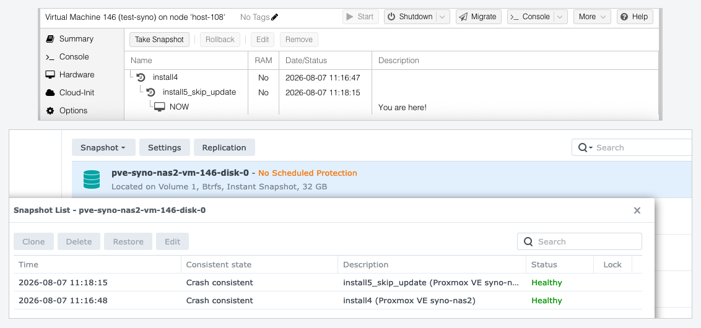
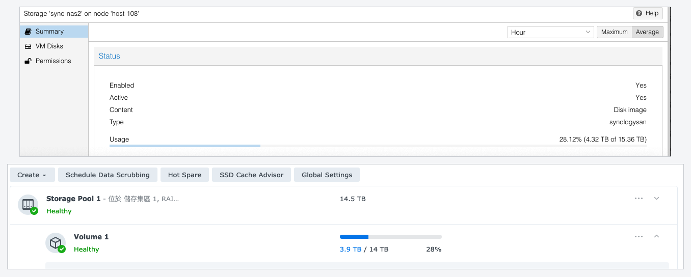

# jt-pve-storage-synology

A Proxmox VE storage plugin for Synology NAS over iSCSI. One VM disk is one
thin LUN on the NAS, so DSM's own snapshots, clones and capacity act on the
unit an operator actually thinks about — no LVM layer, no shared LUN carved up
locally.

[English](README.md) · [繁體中文](README_zh-TW.md) · **[Documentation site](https://jasoncheng7115.github.io/jt-pve-storage-synology/)**

---

> ### Status: **it works on a cluster, and it has been run hard.**
>
> Everything below was driven against a DS918+ on DSM 7.1.1: the full volume
> lifecycle, a guest **booting from the NAS**, backups in all three `vzdump` modes
> restored byte-identical, **live migration across three nodes** at 5 ms and 87 ms
> downtime, and a crashed node's LUN **taken over by a surviving node in 3.6 s**
> while the dead node's session was still registered. Two-portal multipath lost
> **0 of 60 reads** during a path failure, and a DSM management outage left the
> guest with **zero I/O errors**.
>
> What is still honest to say: **one** model, **one** DSM version, no Synology HA
> or dual-controller chassis has ever been near it, and the DSM account needs
> administrator rights because DSM 7.1.1 offers no narrower one — a non-administrator
> cannot even log in. Around twenty-five defects were found by running it that no
> amount of reading had shown, so assume there are more.
>
> `1.0.0` waits on a second model, a second DSM version, and the minimum DSM
> privileges settled. [docs/TESTING.md](docs/TESTING.md) is the register of what is
> verified and what is not, and it is worth reading before trusting this.

---

## Why this exists, and what makes it awkward

Synology publishes no specification for the SAN Manager Web API. The only
official document — the DSM Login Web API Guide — covers logging in and
discovering APIs, and documents no LUN, target, mapping or snapshot call at
all.

What does exist is two independent implementations that talk to it in
production:

- **Synology's own CSI driver**, [SynologyOpenSource/synology-csi](https://github.com/SynologyOpenSource/synology-csi) (Apache-2.0)
- **OpenStack Cinder's Synology driver**, in the [Cinder](https://github.com/openstack/cinder) tree (Apache-2.0)

This project's facts come from reading those two **against each other**, and
then from asking real hardware. That last part matters: the two disagree, and
where they disagree at least one of them is wrong on any given DSM. On the
DSM 7.1.1 used for testing, Cinder's way of carrying a session does not work at
all, and neither client sends the token a DSM with anti-CSRF enabled requires.

Where nothing could be established, this plugin **refuses the operation**
rather than guessing. `docs/TESTING.md` is the register of exactly what that
covers, and it is kept honest.

Only the protocol facts are taken from those projects — API names, method
names, parameters, error codes. No code is derived from either; this is Perl and
its structure is its own.

## What it will do

| PVE operation | On the NAS |
|---|---|
| Create a disk | A thin (`BLUN`) LUN on a Btrfs volume, with `can_snapshot` and UNMAP enabled |
| Delete a disk | Unmap, then delete, with its own snapshots first |
| Grow a disk | LUN expansion, then a bounded per-device refresh on each node |
| Snapshot | DSM LUN snapshot, tagged so it is never confused with a user's own |
| Clone | Clone from a LUN or from one of its snapshots |
| **Rollback** | `restore_snapshot`. The LUN's uuid is unchanged and newer snapshots survive |
| Attach / detach | iSCSI login, device discovered by the kernel's own identification, dm-multipath |

### Your PVE snapshot names are visible in SAN Manager

SAN Manager's snapshot list has columns for time, consistency state,
description, status and lock — and **no name column at all**. The API does carry
a `name`, and the plugin sets it to Proxmox VE's own snapshot name and matches on
it, but nothing in DSM displays it. So from **0.6.5** the plugin writes the name
into the **description** too, as `<snapshot> (Proxmox VE <storage>)`:



Before that every snapshot of every disk on a storage read `Proxmox VE <storage>`
and looked identical, so the one question an operator has in front of that list —
*which PVE snapshot is this row?* — could only be answered by going back to
Proxmox VE and comparing timestamps. Descriptions are written when the snapshot
is taken and DSM never rewrites them, so snapshots taken by an older build keep
the old text.

### Cloning from a snapshot: use the command line, not the button

`qm clone` from a snapshot works, and the web interface will not let you do it.
That is Proxmox VE's shape rather than this plugin's, but the error is confusing
enough to be worth stating plainly:

```
Full clone feature is not supported for a snapshot of 'syno-nas2:vm-146-disk-0'
```

The GUI hardcodes **full clone** for anything that is not a template —
`isTemplate ? 'clone' : 'copy'` in `pvemanagerlib.js` — and a *full* clone means
PVE reads the source itself with `qemu-img convert`, addressing the disk **at the
snapshot**. A Synology LUN has no device at a snapshot, so the plugin declares
that unsupported and PVE refuses before it starts. Declaring it supported is
worse: PVE then begins the operation and fails partway, with a message about a
path rather than about what was asked.

What does work is the **linked** clone, which this storage supports from a
snapshot and which the command line will give you:

```bash
qm clone 146 149 --name from-snapshot --snapname mysnapshot   # no --full
```

On this array "linked" is a misnomer in your favour: DSM's
`clone_from_snapshot` produces a **reflink**, so the new LUN is independent —
deleting the source snapshot afterwards does not affect it — while costing no
space at the moment it is made.

To get the button back, convert the source to a template first: the GUI offers
linked clone for templates.

### Rollback, and why it took a while to get here

Neither reference implementation has a snapshot rollback: Kubernetes and Cinder
both restore by cloning a snapshot into a **new** volume, so neither needed one.
The method was found by asking a DSM about nine candidate names, one of which
answered — **`restore_snapshot`**, taking `src_lun_uuid` and `snapshot_uuid`.

Finding the name was not enough to enable it, because three things had to be
true and none was knowable in advance:

| | |
|---|---|
| The LUN's uuid must not change | **It does not.** So the SCSI serial and the WWID survive, and a node does not suddenly find a different disk where its own was |
| Snapshots newer than the restored one must survive | **They do.** Restoring to the oldest of three left all three in place |
| It must be observable afterwards | `restored_time` records the epoch second of the restore |

The second one is the reason the related projects **refuse** a rollback past
newer snapshots: on those arrays the newer snapshots are destroyed, so a plugin
that let PVE do it silently would delete snapshots the user could still see.
Here nothing is destroyed, so that restriction is not needed and a disk can be
rolled back repeatedly.

## Requirements

| | |
|---|---|
| DSM | **7.0 or later**, and only 7.1.1 has been verified. Dual-controller DSM UC is **refused**, not approximated. See below — the version is a floor, not the decision |
| Volume | **Btrfs.** Snapshots exist only for a thin LUN on Btrfs — an ext4 volume is refused when the storage is added, rather than failing at the first snapshot |
| Model | One with iSCSI target support and enough free space. **The LUN ceiling is per-model and small on some of them** — a DS425+ or any J/Value model publishes **4 LUNs**, which is four virtual disks for the whole storage. Sourced table: [docs/LIMITS.md](docs/LIMITS.md) |
| Network | HTTPS to DSM (5001). Plain HTTP is refused |
| Account | A dedicated DSM account — see **[docs/DSM-ACCOUNT.md](docs/DSM-ACCOUNT.md)**, which also explains the one thing DSM will not let you restrict |
| PVE | 8.x / 9.x. The storage API version is negotiated, never hardcoded |

### The DSM version is a floor, not the decision

**7.0 is required.** The technical floor is lower — Cinder's driver works back
to DSM 6.0.2, and snapshots on a Btrfs thin LUN exist from 6.2 — so 7.0 is a
deliberately conservative choice, for four reasons: SAN Manager is the 7.0
product where 6.x had iSCSI Manager; the access-control object this plugin needs
has only been seen on 7.x; **Synology's own CSI driver requires 7.0 or above**,
which makes that the range Synology itself exercises with an API client; and
DSM 6.2 is end of life, so recommending it for production storage would be
wrong regardless of whether the API works.

Only **7.1.1-42962 Update 9** has actually been verified. Between 7.0 and that,
the plugin should work and has not been tried.

**But passing the version check does not mean a NAS can be used**, and this
matters more than the number:

| What actually decides | Why it beats a version number |
|---|---|
| `support_iscsi_target`, `supportsnapshot`, `support_storage_mgr` from `SYNO.Core.System` | These describe the **model**, not the OS release |
| Whether `SYNO.API.Info` advertises the APIs needed | The test NAS runs 7.1.1 and has no NVMe-of API at all. No version number shows that |
| Whether the volume is **Btrfs** | A stricter constraint than the DSM version: **Btrfs support is model-dependent**, and an entry-level model without it can never snapshot, on any DSM release |

So an entry-level NAS running 7.2 may still be unusable, and a check that only
read the version would not say why. The plugin gates on all four and names the
one that failed.

## How many LUNs, and what happens at the ceiling

One VM disk is one LUN, so the LUN ceiling is a real capacity limit — and it is
not the number on the specification sheet.

**Ask the NAS.** `SYNO.Core.System` `info` with `type=define` reports the
model's own ceilings, and neither public reference client reads them:

| Key | On the test DS918+ | DS918+ datasheet | SAN Manager spec (line-wide) |
|---|---|---|---|
| `max_iscsiluns` | **256** | 256 | 512 |
| `max_iscsitrgs` | **128** | 128 | 256 |
| `max_snapshot_per_lun` | 256 | *not published* | 256 |

So the NAS's API and its own datasheet **agree**; the 512 is the ceiling for the
whole product line, which Synology footnotes as varying by model. Larger models
report larger numbers, smaller ones report as few as **4**; the point is that the
number is per-model and the NAS
will tell you which one applies.

### What happens when you reach it

DSM refuses cleanly — **18990541** for LUNs, **18990542** for targets,
**18990543** for snapshots. Nothing is damaged. But the refusal reaches an
operator as an allocation failure with a five-digit number in it, while
`pvesm status` goes on showing terabytes free, because free space is not the
problem and adding disks will not fix it.

### So the plugin refuses first

Before it asks the NAS to create anything it compares the LUN count against
`max_iscsiluns` and refuses with a message that names the real reason: the NAS
holds its model's maximum number of LUNs, deleting is the only remedy. It also
warns once when fewer than sixteen remain, while there is still time to plan.

**The count includes LUNs this storage does not own** — the owner's own LUNs and
any Virtual Machine Manager virtual disks all consume the same ceiling. That is
the second reason this plugin never sends the types filter Synology's own client
sends: that filter hides exactly those objects, so a client trusting it would
under-count against the very ceiling it was checking.

### The three ceilings, in the order they will bite

1. **LUNs** — one per VM disk. The real limit for a busy storage.
2. **Snapshots per LUN**, 256, **shared with the user's own schedule.** A LUN
   with a SAN Manager snapshot schedule on it has fewer left for PVE, and
   "cannot take a snapshot" will not obviously be about that.
3. **Targets**, 128 here. Irrelevant in the default `shared` target mode, which
   uses one — and the reason `per-volume` is not the default, since it would cap
   the storage at 128 disks, *below* the LUN ceiling.

## High availability and dual controllers

Synology has two arrangements that both get called "HA", and they are different
problems with different answers. **Both are supported.**

| | **Synology HA (SHA)** | **UC / SA dual controller** |
|---|---|---|
| Shape | two chassis, active/passive | two controllers in one chassis |
| Detected by | — | `firmware_ver` contains `DSM UC` |
| Management address | **one floating cluster IP** | **one per controller, none floating** |
| Configure as | `--syno-portal <cluster-ip>` | `--syno-portal <ctrl-a>,<ctrl-b>` |
| Closest analogue | Pure Storage's `vir0` | PowerVault ME's two controller addresses |

`syno-portal` takes a list, tried in order and rotated on failure. The rotation
happens **inside** the login and the request URL is built after it — a related
project shipped a bug where the URL was built first, so every retry went on
travelling to the address that had just been found dead.

For a UC chassis the second address does not have to be configured:
`SYNO.Core.Network.Interface` accepts `relay_node=node0` and `node1`, which
enumerates the peer controller's interfaces. On a single-controller NAS both
answer with the same interfaces, so the mechanism is harmless where it is not
needed. On those models a target's `network_portals` also carries a
`controller_id`, which a single-controller NAS omits entirely.

### Neither has been run on hardware, and the plugin says so

SHA is low risk: it is one address that happens to move, which is the case the
plugin already handles. UC is a genuine unknown, and the open questions are the
ones only a chassis can answer — whether a LUN is owned by one controller, and
whether a target's portals differ per controller. Together those decide whether
a node still reaches its disk after a failover.

So the plugin **warns** when it detects `DSM UC` rather than refusing, and this
page will keep saying "unverified" until someone reports a run. Both are in the
register as R-15 and R-16.

**If you run either, the most useful thing you can report is one number**: does
`SYNO.Core.ISCSI.Node`'s uuid stay the same across a failover? A storage's
identity is pinned to it, so if it changes, that pin stops protecting the
storage and starts breaking it.

## Installing

On every node of the cluster.

```bash
# on each node — the two packages PVE does not install for you
apt update
apt install -y open-iscsi multipath-tools

cd /tmp
wget -O jt-pve-storage-synology_all.deb \
  https://github.com/jasoncheng7115/jt-pve-storage-synology/releases/latest/download/jt-pve-storage-synology_all.deb
apt install -y ./jt-pve-storage-synology_all.deb

dpkg -l jt-pve-storage-synology | awk '/^ii/{print $3}'    # check what you got
```

> **The `-O` is not decoration.** Without it, `wget` refuses to overwrite a file
> that is already there and saves the download as
> `jt-pve-storage-synology_all.deb.1` instead — then `apt install
> ./jt-pve-storage-synology_all.deb` installs the **old** file sitting in `/tmp`
> from last time. Reported on a real node, where it silently downgraded 0.6.7 to
> 0.6.5: `apt` prints a `DOWNGRADING:` line, and with `-y` it does not stop to
> ask. That is why the version check is the last line of the block.

No service restart is needed, and that was measured rather than assumed. The package
installs into `/usr/share/perl5/PVE`, which `pve-manager` watches with an
`interest-noawait` trigger — the *Processing triggers for pve-manager* line in the
output — and its postinst runs `reload-or-try-restart` on `pvedaemon`, `pvestatd`,
`pveproxy`, `spiceproxy` and `pvescheduler`. A reload is enough: with the package
removed `pvedaemon` does not list `synologysan` among the storage types it accepts,
and installing it makes the daemon validate `synologysan` options immediately — with
its PID unchanged throughout — `exec(2)` keeps the PID while replacing the running
program, which is exactly what `pvedaemon restart` does when the trigger HUPs it:

```
pvedaemon[1333139]: received signal HUP
pvedaemon[1333139]: server shutdown (restart)
systemd[1]: Reloaded pvedaemon.service - PVE API Daemon.
pvedaemon[1333139]: restarting server
pvedaemon[1333139]: starting 3 worker(s)
```

So this holds for an **upgrade** as much as a first install: the master re-execs and
forks fresh workers that read the new modules from disk. Workers already serving a
request finish on the old code — about five seconds, in the run above — so an
operation started during the upgrade may complete on the version you just replaced.
If something blocks `deb-systemd-invoke`, `systemctl restart pvedaemon pveproxy
pvestatd` is the fallback.

## Upgrading

The same commands. `apt install` on a newer `.deb` upgrades in place, the same
trigger reloads the daemons, and **no restart is needed** — see the journal above.

```bash
cd /tmp
rm -f jt-pve-storage-synology_all.deb*
wget -O jt-pve-storage-synology_all.deb \
  https://github.com/jasoncheng7115/jt-pve-storage-synology/releases/latest/download/jt-pve-storage-synology_all.deb
apt install -y ./jt-pve-storage-synology_all.deb

dpkg -l jt-pve-storage-synology | awk '/^ii/{print $3}'
```

Three things that are only true of an upgrade:

- **The `rm -f` is the important line**, for the reason in the box above. An upgrade
  is exactly when a stale `.deb` from the previous upgrade is sitting there.
- **Do every node before you trust the result.** A storage operation runs where the
  guest is, so a half-upgraded cluster behaves differently depending on which node a
  VM happens to be on. There is no downgrade path for a storage that has already
  been used, but there is nothing to migrate either: the plugin keeps no on-disk
  state beyond `/etc/pve/priv/storage/<storage>.syno` and the per-node WWID list
  under `/var/lib`, and both are read by every version.
- **Nothing needs to be stopped.** Running guests keep their devices: the package
  replaces Perl modules, and it does not touch iSCSI sessions, multipath maps or the
  drop-in in `/etc/multipath/conf.d`.


> **Keep the version the same on every node.** A storage operation runs on the node
> that owns the guest, using *that node's* copy of the plugin — not the one on the
> node you are browsing from. A cluster with mixed versions therefore behaves
> differently depending on where a VM happens to be, and the symptom is baffling: a
> fix you installed is simply absent for some guests. Check with
> `dpkg -l jt-pve-storage-synology | awk '/^ii/{print $3}'` on each node.

> **Every node, or the storage is invisible in the web interface.** `pvesm add`
> writes to the cluster configuration, so one node is enough to create the storage —
> but the web interface is served by *whichever node your browser is connected to*,
> and `pveproxy` loads its plugin list at startup. A node without the plugin does
> not know the `synologysan` type and **silently omits the storage from the list**.
> It exists and works on the nodes that do have it; it just is not shown — which
> reads exactly like `pvesm add` having failed, and it did not. Install on every
> node and restart the daemons on each, including the one you are browsing from. To
> limit the storage to the nodes that are ready:
> `pvesm set <storage> --nodes nodeA,nodeB`.

> **If a `dpkg -i` already failed here.** An earlier version of this page said
> `dpkg -i`. That leaves the package unpacked but *unconfigured*, and apt then
> refuses to solve anything else — you get `Unmet dependencies` naming `kpartx`
> and `sg3-utils-udev` as "not going to be installed", which looks like a
> repository problem and is not. Run `dpkg --remove jt-pve-storage-synology`
> first, then the block above. If the prerequisites still will not resolve, check
> `apt policy kpartx sg3-utils-udev` — `kpartx` comes from Debian `trixie/main`
> and `sg3-utils-udev` from the Proxmox VE repository.

`open-iscsi` and `multipath-tools` are the two a Proxmox VE node can genuinely be
missing — nothing in PVE pulls them in, and installing `multipath-tools` is what the
maintenance window is really about. The four Perl modules the package also needs are
dependencies of 86 to 151 PVE packages each, so they are already there.

Then `apt install ./…`, not `dpkg -i`: `dpkg` does not resolve dependencies —
on a node without `multipath-tools` it unpacks and then fails with *dependency
problems — leaving unconfigured*. The leading `./` is required, or apt treats the
argument as a package name.

That URL always points at the newest release, so it does not go stale — the `beta1`
suffix is gone from 0.6.4 onwards, so releases are no longer flagged as prereleases
(which GitHub's `latest` used to skip), and each release publishes the package a
second time under this version-free name. To pin a version, take the URL from the
[releases page](https://github.com/jasoncheng7115/jt-pve-storage-synology/releases).
From a clone, `make install`.

> **Schedule the first install.** `activate_storage` writes a multipath drop-in for
> `vendor "SYNOLOGY"` and, when that file changes, runs `multipathd reconfigure` —
> a **node-wide** command. It runs once, when the file first appears or changes.
>
> **Measured: it does not disturb another vendor's storage.** On multipath-tools
> 0.11.1, with continuous direct reads against an existing unrelated map, a
> `multipathd reconfigure` gave **1776 reads and 0 failures**, the map's
> device-mapper **event counter did not move** — so it was never reloaded — and its
> path stayed `active ready running`. Reconfigure re-reads configuration but only
> reloads a map whose configuration actually changed. The maintenance window is
> advice for a first install on a production node, not a known outage.
>
> The drop-in is mandatory rather than tuning: without it multipath's generic
> defaults apply, and those include `no_path_retry "queue"`, which turns the loss
> of every path into an unkillable process instead of an I/O error.

Four of these plugins can share a node — but `PVE::SectionConfig::init` **dies on a
duplicate property name**, and every storage on the node then stops working. The
`syno-` prefix exists for that reason.

## Configuring a storage

Once, on one node. The storage is shared by construction.

```bash
pvesm add synologysan mysyno \
    --syno-portal   192.0.2.10 \
    --syno-username pve-storage \
    --syno-password '<the password>' \
    --syno-location /volume1 \
    --content       images \
    --nodes         pve1,pve2,pve3    # optional: restrict to these nodes
```

### Restricting it to some nodes

`nodes` is Proxmox VE's own property, not a `syno-` one, and it works here like on
any other storage:

```bash
pvesm set mysyno --nodes pve1,pve2     # restrict an existing storage
pvesm set mysyno --delete nodes        # open it to the whole cluster again
pvesm status --storage mysyno          # check
```

Two reasons to use it. A node **without the plugin installed** will otherwise log
*unknown storage type* on every `pvestatd` poll — restricting the storage is the
clean way to stage a rollout. And a node with **no route to the NAS's data
portals** has no business trying; it will fail to activate volumes rather than fail
politely.

`shared` is forced on and cannot be turned off — the plugin registers itself in
`SHARED_STORAGE`, because a LUN on a NAS is reachable from every node by
construction. So `nodes` restricts *which nodes may use it* and never makes the
storage node-local. Live migration works between any two nodes the list allows.

`pvesm add` refuses immediately if the volume is not Btrfs, if the model does not
support iSCSI targets or snapshots, or if the storage id would fold onto an existing
storage's LUN prefix.

**The password never lands in `/etc/pve/storage.cfg`.** It goes to
`/etc/pve/priv/storage/<storage>.syno`, mode `0600`, root only, replicated to every
node. Full option list and the removal procedure: the
[documentation site](https://jasoncheng7115.github.io/jt-pve-storage-synology/#configure).

### Why the size in Proxmox VE does not match the size in DSM

It does — the two count in different units and both call them TB.

The plugin reports the DSM volume's `size_total_byte` and `size_free_byte`
**verbatim, in bytes**, and does no arithmetic on either. Everything after that
is display. Proxmox VE's storage summary formats bytes with SI units, dividing
by 1000; DSM's Storage Manager divides by 1024 and still writes "TB". So the
same volume reads:



| | Total | Used |
|---|---|---|
| Proxmox VE | 15.36 TB | 4.32 TB |
| DSM Storage Manager | 14 TB | 3.9 TB |

Both are 15,356,124,401,664 and 4,318,122,532,864 bytes. The ratio between the
two columns is 2⁴⁰ ÷ 10¹², which is 1.0995 — and 15.36 ÷ 14 is 1.0971, the same
number once DSM's rounding to two significant figures is allowed for. The
percentages agree, which is the quick check: 28.12% against 28%.

Proxmox VE is not consistent with itself here either — a VM's memory is shown as
`4.00 GiB`, binary and labelled as such, on the same interface. That is Proxmox
VE's convention and the plugin does not attempt to second-guess it.

## The discovery tool

This works today, and it is worth running before anything else. It is
**read-only**: it creates nothing, deletes nothing, and logs out after itself.
It is safe against a production NAS.

```bash
bin/pve-syno-api-probe --host 192.0.2.10 --user pve-storage
```

The password is prompted for with echo off — never passed on the command line,
where it would be visible in `ps` and in the shell history.

It reports the API set and every version range the NAS accepts, whether
anti-CSRF is on, the DSM volumes and their filesystems, the LUNs and targets as
they are now, the `dev_attribs` of an existing LUN, and — at the end — a
register of what the run settled and what still needs a write to answer.

```
--probe-methods    ask which snapshot-restore method names exist
--otp <code>       for an account with 2-factor authentication
--json             also print the findings as JSON
```

`--probe-methods` is opt-in. It names a LUN and snapshot uuid the NAS has never
issued, so a method that exists can only refuse — and the refusal proves it is
there. Nothing it could act on is real, but the names being sent are
destructive ones, so it asks first.

## The cleanup tool

`pve-syno-reap` reports — and with `--remove` clears — multipath maps this node
holds for LUNs the NAS no longer has, and tracking entries left by a crash.
**Default is a dry run.**

```bash
pve-syno-reap --storage <storage>            # show what is left behind
pve-syno-reap --storage <storage> --remove   # then act
pve-syno-reap --all --remove                 # every synologysan storage on this node
```

**Run it after a node crash, and on every node before removing a storage.** Two
things make it necessary, both measured on a three-node cluster:

- Proxmox VE's only `deactivate_volumes` call during migration is inside
  `sync_offline_local_volumes`, so for a **shared** storage the source node is
  never told a VM left. A VM migrated `pve1 → pve2 → pve3` and destroyed on pve3
  leaves pve1 and pve2 each holding a map for a LUN that no longer exists.
- A hard-reset node never runs `deactivate_volume` at all, so its tracking file
  keeps an entry for a LUN it is no longer attached to.

Neither is dangerous — every consumer re-checks for a device before acting, and
device identity always comes from the kernel's WWID — but they accumulate. The
tool never touches a device that is in use, and skips rather than assumes anything
whose state it cannot establish.

Nothing in Proxmox VE calls `deactivate_storage` (verified across the whole
`/usr/share/perl5/PVE` tree), so this cleanup is the operator's, not PVE's.

## Documentation

| | |
|---|---|
| [docs/TESTING.md](docs/TESTING.md) | What is verified, what is not, and the test plan. **Read this before trusting anything** |
| [docs/DSM-ACCOUNT.md](docs/DSM-ACCOUNT.md) | The DSM account, its minimum privileges, Auto Block, 2FA, TLS |
| [docs/LIMITS.md](docs/LIMITS.md) | Every model's published LUN and target maxima, with the official source for each figure |

## Related projects

Proxmox VE storage plugins for other arrays, sharing the host-side layer and
the operational rules this one inherits:

- [jt-pve-storage-dellemc](https://github.com/jasoncheng7115/jt-pve-storage-dellemc) — Dell EMC PowerStore, PowerVault ME, PowerFlex, Unity XT
- [jt-pve-storage-netapp](https://github.com/jasoncheng7115/jt-pve-storage-netapp) — NetApp ONTAP
- [jt-pve-storage-purestorage](https://github.com/jasoncheng7115/jt-pve-storage-purestorage) — Pure Storage FlashArray

## Licence

MIT. See [LICENSE](LICENSE).

This project is not affiliated with or endorsed by Synology Inc. Synology and
DSM are trademarks of Synology Inc.

## Author

Jason Cheng (Jason Tools) &lt;jason@jason.tools&gt;
