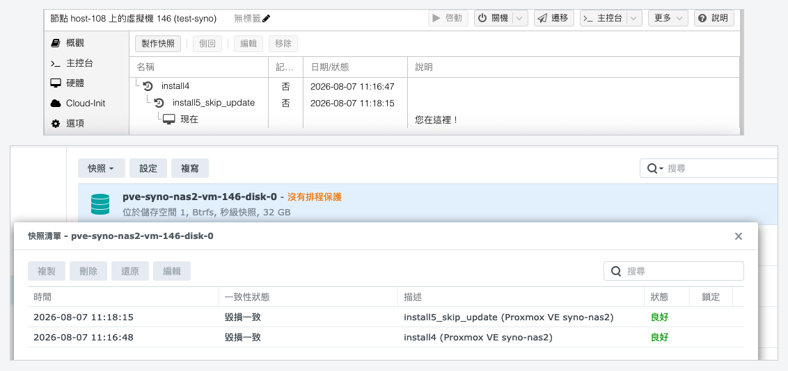
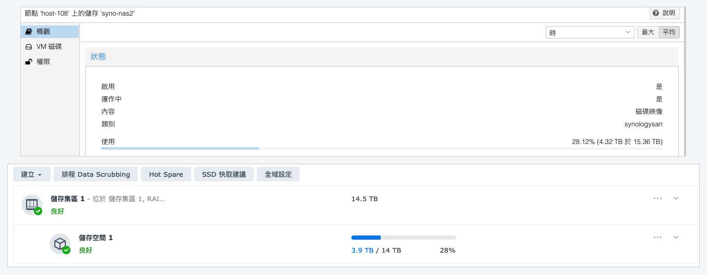

# jt-pve-storage-synology

透過 iSCSI 連接 Synology NAS 的 Proxmox VE 儲存 plugin。**一顆 VM 磁碟就是 NAS 上一個精簡配置 LUN**，所以 DSM 自己的快照、複本與容量都作用在操作者心裡想的那個單位上——沒有 LVM 夾層，也不把一個共用 LUN 在本機切開。

[English](README.md) · [繁體中文](README_zh-TW.md) · **[文件網站](https://jasoncheng7115.github.io/jt-pve-storage-synology/?lang=zh)**

---

> ### 狀態：**它在叢集上可以運作，而且已經被大量操作驗證過。**
>
> 以下每一項都對一台 DS918+（DSM 7.1.1）實際跑過：完整的磁碟生命週期、一台**從 NAS 開機**的 guest、三種 `vzdump` 模式的備份都還原成完全相同的位元組、**跨三個節點的即時遷移**（中斷 5 毫秒與 87 毫秒），以及一個當掉節點的 LUN **由存活節點在 3.6 秒內接手**，而當時死掉節點的工作階段仍然登記在 NAS 上。兩個 portal 的 multipath 在路徑故障期間 **60 次讀取失敗 0 次**，而一次 DSM 管理連線中斷讓 guest 出現**零個 I/O 錯誤**。
>
> **第二個機型與第二個 DSM 版本已經完整跑過了**：一台透過 VPN 連到的 **DS925+，DSM 7.3.2-86009 Update 4**。`pvesm add`、建立 LUN、**建立 target**、iSCSI 登入、multipath、guest 開機、快照、**倒回**（而且有儲存伺服器自己的 `restored_time` 作證）最後把整個 storage 移除，**兩邊都沒有留下任何東西**。每一個 API 都存在，版本與 CGI 路徑相同，包括 `SYNO.API.Auth` 在 `entry.cgi`，而不是兩份公開參考實作寫死的 `auth.cgi`。
>
> 有些事沒有在那台上重複做：**擴充、複製、備份、還原、遷移、雙 portal multipath 與 HA 只在 DS918+ 上跑過**。而那台是透過 VPN 連的，測試沒問題，但**不是**正式環境 guest 磁碟該待的地方——隧道斷掉等於拔掉排線。
>
> 仍然該誠實說的是：從來沒有任何 Synology HA 或雙控制器機箱接近過這個東西，而那個 DSM 帳號需要管理員權限，因為 DSM 沒有更窄的選擇，非管理員連登入都過不了。從實際運行中找出大約三十個「讀程式碼永遠讀不出來」的缺陷，所以請假設還有更多。
>
> `1.0.0` 在等的是：確定最小的 DSM 權限，以及剩下那些操作也在第二個機型上重複一次。[docs/TESTING_zh-TW.md](docs/TESTING_zh-TW.md) 是那份「哪些驗證過、哪些沒有」的驗證紀錄，在信任這個東西之前值得讀一遍。

---

> ### 建議先從非核心系統開始測試
>
> 上面每一項都是量測出來的，但那都不能取代你自己的硬體和你自己的 DSM 版本。請先用一台非核心的 guest 開始：拍一次快照、倒回一次、跑一次備份，讓它運行幾天，再把重要的東西搬上來。兩個機型、三個 DSM 版本，對照 Synology 賣的機型數量只是很小的樣本。

## 已在正式環境的叢集上實際跑過

以下每一項都是在一個五節點、正式運行中的 Proxmox VE 叢集上，**從網頁介面與指令列各跑一次**，對一台 DS918+（DSM 7.1.1）跑出來的。介面很重要：`pvedaemon`、`pveproxy`、`vzdump` 與 `pct` 是 `#!/usr/bin/perl -T` 而且**沒有 `PATH`**，而 `qm`、`pvesm`、`pvesh`、`qmrestore` 不是，所以「在 shell 上驗證過」不等於驗證過。

| | 已驗證 |
|---|---|
| **磁碟** | 建立 · 擴充 · 移動到別的 storage 再移回 · 在 guest 執行中卸離並移除 |
| **快照** | 執行中拍 · 關機拍 · **倒回** · 刪除 · PVE 的快照名稱在 SAN Manager 的描述欄看得到 |
| **Guest** | 關機與啟動 · **離線與線上遷移，兩個方向** · 完整複製 · 從快照複製 · 轉成範本，再從它做連結複製與完整複製 |
| **備份** | `vzdump` 三種模式全部——快照、暫停、停止 |
| **還原** | 還原到新的 VM ID · 覆蓋原本的 VM |
| **叢集** | 五個節點就地升級，**不需要重啟服務**；`pve-syno-reap` 對每一台都回報乾淨 |

有兩個結果值得單獨寫出來，因為那是區塊儲存 plugin 最容易做錯的地方：

- **兩邊都沒有留下任何東西**。上面全部做完之後，NAS 上有五顆 LUN 與五筆 target 對應，每一筆都對得上一個 VM 設定——沒有孤兒 LUN，沒有失效對應。節點上有五個 multipath map 與五筆追蹤記錄，也對得上。
- **刪掉範本不會弄壞它的連結複本**。在複本執行中把範本的 LUN 移除，複本照樣跑：DSM 的複製是 reflink，沒有相依關係可以壞。多數 storage 在這裡會失去複本，而 Proxmox VE 會擋住你。它會去問 storage，而這個 storage 正確地回答「沒有東西需要保護」。

每一個修正都附帶一個「拿掉修正就會失敗」的測試。哪些驗證過、哪些沒有，驗證紀錄在 [docs/TESTING_zh-TW.md](docs/TESTING_zh-TW.md)。

## 為什麼有這個專案，以及技術上的難處

Synology 沒有公開 SAN Manager Web API 的規格。唯一的官方文件（DSM Login Web API Guide）只涵蓋登入與 API 探索，完全沒有記載任何 LUN、target、對應或快照的呼叫。

真正存在的是兩份在生產環境和它對話的獨立實作：

- **Synology 官方的 CSI driver**，[SynologyOpenSource/synology-csi](https://github.com/SynologyOpenSource/synology-csi)（Apache-2.0）
- **OpenStack Cinder 內建的 Synology driver**，在 [Cinder](https://github.com/openstack/cinder) 的原始碼樹裡（Apache-2.0）

這個專案的事實來自**把這兩份互相對讀**，然後再去問實機。最後那一步很重要：兩份的做法有出入，而不一致的地方由 NAS 決定。

凡是無法確認的地方，這個 plugin **拒絕該操作**，而不是猜。`docs/TESTING_zh-TW.md` 就是那份驗證紀錄，而且它會被誠實地維護。

從那兩個專案取用的只有協定事實：API 名稱、方法名稱、參數、錯誤碼。沒有任何程式碼衍生自它們；本專案是 Perl，結構是自己的。

## 它將會做的事

| PVE 操作 | 在 NAS 上 |
|---|---|
| 建立磁碟 | 在 Btrfs 儲存空間上建立精簡（`BLUN`）LUN，並開啟 `can_snapshot` 與 UNMAP |
| 刪除磁碟 | 先解除對應再刪除，並且先刪掉它自己的快照 |
| 擴充磁碟 | LUN 擴充，然後在每個節點做有界的逐裝置重新掃描 |
| 快照 | DSM 的 LUN 快照，並加上標記，絕不與使用者自己的快照混淆 |
| 複製 | 從 LUN 或它的某個快照複製 |
| **倒回** | `restore_snapshot`。LUN 的 uuid 不變，較新的快照也存活 |
| 掛上／卸離 | iSCSI 登入，裝置由核心自己的識別找出，dm-multipath |

### 你在 PVE 取的快照名稱，在 SAN Manager 裡看得到

SAN Manager 的快照清單有時間、一致性狀態、描述、狀態與鎖定這幾欄——**完全沒有名稱欄**。API 裡確實有 `name`，plugin 也會把它設成 Proxmox VE 自己的快照名稱並據以比對，但 DSM 沒有任何地方會顯示它。所以從 **0.6.5** 起，plugin 也會把名稱寫進**描述**，格式是 `<快照名稱> (Proxmox VE <storage>)`：



在那之前，一個 storage 上每顆磁碟的每個快照，描述都是 `Proxmox VE <storage>`，長得一模一樣，所以操作者站在那份清單前唯一會問的問題（**這一列是哪一個 PVE 快照？**）只能回到 Proxmox VE 比對時間才答得出來。描述是拍快照當下寫進去的，DSM 不會回頭改寫，所以舊版拍的快照會保留舊的文字。

### 從快照複製：範本用網頁介面，其餘用指令列

從快照 `qm clone` 是可以的，而網頁介面不會讓你做。這是 Proxmox VE 的形狀，不是這個 plugin 的問題，但那個錯誤訊息夠讓人困惑，值得直接講清楚：

```
Full clone feature is not supported for a snapshot of '<storage>:vm-146-disk-0'
```

GUI 對任何「不是範本」的東西一律寫死用**完整複製**：`pvemanagerlib.js` 裡的 `isTemplate ? 'clone' : 'copy'`，而「完整」複製的意思是 PVE 自己用 `qemu-img convert` 去讀來源，而且是定址到**快照當下的那顆磁碟**。Synology 的 LUN 在快照上沒有裝置，所以 plugin 宣告不支援，PVE 就在動手之前拒絕。宣告支援反而更糟：PVE 會開始做、做到一半失敗，而訊息講的是路徑，不是你要求的那件事。

真正可行的是**連結**複製，這個 storage 從快照支援它。指令列會給你，而且**`--full 0` 是必要的**——省略 `--full` 不等於同一件事，因為 Proxmox VE 對任何「不是範本」的東西把它預設為「真」：

```bash
qm clone 146 149 --name from-snapshot --snapname mysnapshot --full 0
```

在這台儲存伺服器上，「連結」這個字反而說得太保守了：DSM 的 `clone_from_snapshot` 產生的是 **reflink**,所以新的 LUN 是獨立的（之後把來源快照刪掉也不影響它）而建立當下不佔任何空間。

想把按鈕拿回來，就先把來源轉成範本：GUI 對範本會提供連結複製。

### 快照倒回，以及為什麼繞了一段路才走到這裡

兩份參考實作都沒有快照倒回：Kubernetes 與 Cinder 都是用「把快照複製成一個**新的** volume」來還原，所以兩者都不需要。這個方法是靠對一台 DSM 詢問九個候選名稱找到的，其中一個回答了——**`restore_snapshot`**，收 `src_lun_uuid` 與 `snapshot_uuid`。

但找到名稱還不足以把它打開，因為有三件事必須成立，而事先沒有一件是可知的：

| | |
|---|---|
| LUN 的 uuid 不可以變 | **它不會變**。所以 SCSI 序號與 WWID 都存活，節點不會突然在自己磁碟的位置上找到另一顆 |
| 比快照時間點更新的快照必須存活 | **會存活**。還原到三個之中最舊的那一個，三個都還在 |
| 事後必須看得出來 | `restored_time` 會記錄還原當下的 epoch 秒 |

第二件說明了相關專案為什麼**拒絕**越過較新的快照倒回：在那些陣列上較新的快照會被銷毀，所以讓 PVE 默默做那件事的 plugin，等於刪掉使用者還看得到的快照。這裡什麼都不會被銷毀，所以那道限制不需要，一顆磁碟也可以反覆倒回。

## 需求

| | |
|---|---|
| DSM | **7.0 以上**，已驗證 **7.1.1**、**7.3.2** 與 **7.4.1**。雙控制器的 DSM UC 會被**拒絕**，不會假裝支援。見下——版本號只是門檻，不是判準 |
| 儲存空間 | **Btrfs**。快照只存在於 Btrfs 上的精簡 LUN：ext4 的儲存空間在加入 storage 時就被拒絕，而不是等到第一次拍快照才失敗 |
| 型號 | 支援 iSCSI target 且有足夠可用空間者。**LUN 上限是看機型的，而且某些機型很小**：DS425+ 或任何 J／Value 機型公布的是 **4 個 LUN**，也就是整個 storage 只有四顆虛擬磁碟。附出處的表格：[docs/LIMITS_zh-TW.md](docs/LIMITS_zh-TW.md) |
| 網路 | 以 HTTPS 連到 DSM（5001）。純 HTTP 一律拒絕 |
| 帳號 | 一個專用的 DSM 帳號——見 **[docs/DSM-ACCOUNT_zh-TW.md](docs/DSM-ACCOUNT_zh-TW.md)**，其中也說明了 DSM 唯一不讓你限制的那件事 |
| PVE | 8.x／9.x。儲存 API 版本是協商出來的，從不寫死 |

### DSM 版本只是門檻，不是判準

**要求 7.0 以上**。技術下限其實更低：Cinder 的 driver 一路支援到 DSM 6.0.2，而 Btrfs 精簡 LUN 的快照從 6.2 就有，所以 7.0 是刻意選的保守值，理由有四個：SAN Manager 是 7.0 才有的產品，6.x 是 iSCSI Manager；本 plugin 需要的存取控制物件只在 7.x 上見過；**Synology 自己的 CSI driver 就要求 7.0 以上**，那是 Synology 自己會拿 API 用戶端去實際跑的範圍；而 DSM 6.2 已經 EOL，不管 API 通不通，拿它跑生產儲存都不該被建議。

真正驗證過的只有 **7.1.1-42962 Update 9**。7.0 到那之間應該可以用，但沒試過。

**但版本檢查通過不代表這台 NAS 能用**，而這件事比那個數字重要：

| 真正決定的東西 | 為什麼它比版本號可靠 |
|---|---|
| `SYNO.Core.System` 的 `support_iscsi_target`、`supportsnapshot`、`support_storage_mgr` | 這些描述的是**機型**，不是 OS 版本 |
| `SYNO.API.Info` 有沒有公佈需要的 API | 測試機跑 7.1.1，卻完全沒有 NVMe-oF 的 API。沒有任何版本號看得出這件事 |
| 儲存空間是不是 **Btrfs** | 比 DSM 版本更嚴的限制：**Btrfs 支援是看機型的**，沒有 Btrfs 的入門機不管哪一版 DSM 都拍不出快照 |

所以一台跑 7.2 的入門機仍然可能不能用，而只讀版本號的檢查不會說出原因。plugin 會四項全查，並指出是哪一項不過。

## LUN 數量上限，以及達到上限時的行為

一顆 VM 磁碟就是一個 LUN，所以 LUN 的上限是實實在在的容量限制，而它不是技術規格表上那個數字。

**問 NAS。**`SYNO.Core.System` 的 `info`（`type=define`）會回報機型自己的上限，而兩份公開的參考實作都沒有讀它：

| 鍵 | 測試機 DS918+ | DS918+ 規格表 | SAN Manager 規格（整條產品線）|
|---|---|---|---|
| `max_iscsiluns` | **256** | 256 | 512 |
| `max_iscsitrgs` | **128** | 128 | 256 |
| `max_snapshot_per_lun` | 256 | *未公布* | 256 |

所以 NAS 的 API 和它自己的規格表**是一致的**；512 是整條產品線的上限，而 Synology 註明它依機型而異。更大的機型會回報更大的數字，更小的機型少到只有 **4 個**；重點是這個數字是看機型的，而且 NAS 會告訴你哪一個適用。附出處的完整表格在 [docs/LIMITS_zh-TW.md](docs/LIMITS_zh-TW.md)。

### 達到上限時會發生什麼

DSM 會明確拒絕並回報錯誤碼：LUN 是 **18990541**、target 是 **18990542**、快照是 **18990543**。什麼都不會壞。但那個拒絕到操作者眼前是「配置失敗」加一個五位數字，而 `pvesm status` 還繼續顯示好幾 TB 可用，因為可用空間不是問題所在，加硬碟也解決不了。

### 所以 plugin 會先拒絕

在請 NAS 建立任何東西之前，它會把 LUN 數量和 `max_iscsiluns` 比對，然後用一句說得出真正原因的話拒絕：NAS 已經放到這個機型的 LUN 上限，唯一的解法是刪掉一些。剩下不到十六個時它也會警告一次，那時候還來得及規劃。

**這個數量包含不屬於這個 storage 的 LUN**——擁有者自己的 LUN、以及任何 Virtual Machine Manager 的虛擬磁碟，全都吃同一個上限。這就是本 plugin 從不送 Synology 自己那份型態過濾條件的第二個理由：那個過濾條件藏起來的正是這些物件，所以任何相信它的用戶端，會在它正在檢查的那個上限上少算。

### 三個上限，依照先後遇到的順序

1. **LUN**——每顆 VM 磁碟一個。對一個忙碌的 storage 來說，這是真正的限制。
2. **每顆 LUN 的快照 256 個，而且和使用者自己的排程共用額度**。一顆設了 SAN Manager 快照排程的 LUN，留給 PVE 的就更少，而「拍不出快照」不會明顯看起來和那件事有關。
3. **Target**，這台是 128 個。在預設的 `shared` target 模式下無關緊要，因為只用一個，而這也正是 `per-volume` 不是預設的原因：它會把 storage 卡在 128 顆磁碟，**低於** LUN 的上限。

## 高可用性與雙控制器

Synology 有兩種都被叫做「HA」的架構，但它們是兩個不同的問題、有不同的答案。**兩種都支援。**

| | **Synology HA（SHA）**| **UC／SA 雙控制器** |
|---|---|---|
| 架構 | 兩台機箱，主／備 | 一個機箱兩個控制器 |
| 偵測方式 | —| `firmware_ver` 含 `DSM UC` |
| 管理位址 | **一個叢集共用的虛擬 IP** | **每個控制器各一個，沒有虛擬 IP** |
| 設定方式 | `--syno-portal <叢集 IP>` | `--syno-portal <控制器 A>,<控制器 B>` |
| 最接近的類比 | Pure Storage 的 `vir0` | PowerVault ME 的兩個控制器位址 |

`syno-portal` 收一份清單，依序嘗試、失敗就輪替。輪替發生在登入**裡面**，而請求的 URL 是在輪替之後才組，所以重試會送往下一個位址，不會繼續送往剛剛才失敗的那一個。

UC 機箱的第二個位址不必手動設定：`SYNO.Core.Network.Interface` 接受 `relay_node=node0` 與 `node1`，可以列舉對側控制器的介面。在單控制器的 NAS 上兩者回傳相同的介面，所以這個機制在不需要它的地方是無害的。那些機型上，target 的 `network_portals` 還會帶 `controller_id`，而單控制器的 NAS 完全不回傳這個欄位。

### 兩種都沒有在實機上跑過，而 plugin 會說出這件事

SHA 風險低：它就是一個會移動的位址，而那正是 plugin 已經處理的情況。UC 是真正的未知，而未解的問題正是只有機箱能回答的——一顆 LUN 是否由單一控制器擁有、target 的 portal 是否依控制器而不同。這兩件合起來決定故障切換之後節點還找不找得到自己的磁碟。

所以 plugin 偵測到 `DSM UC` 時**發出警告**而不是拒絕，而這一頁會一直寫著「未驗證」，直到有人回報實際運行結果。兩者在驗證紀錄上都列為未驗證。

**如果你手上有其中任何一種，最有價值的回報是一個數字**：`SYNO.Core.ISCSI.Node` 的 uuid 在故障切換之後還是同一個嗎？storage 的身分釘在它上面，所以如果它會變，那道釘子就不再保護 storage，而是開始破壞它。

## 安裝

叢集的每一個節點都要裝。

```bash
# 叢集中每個節點都要 —— PVE 不會替你裝的兩個套件
apt update
apt install -y open-iscsi multipath-tools

cd /tmp
wget -O jt-pve-storage-synology_all.deb \
  https://github.com/jasoncheng7115/jt-pve-storage-synology/releases/latest/download/jt-pve-storage-synology_all.deb
apt install -y ./jt-pve-storage-synology_all.deb

dpkg -l jt-pve-storage-synology | awk '/^ii/{print $3}'    # 確認裝到的是哪一版
```

> **那個 `-O` 不是裝飾**。少了它，`wget` 不會覆蓋已經存在的檔案，而是把下載的東西存成 `jt-pve-storage-synology_all.deb.1`——接著 `apt install ./jt-pve-storage-synology_all.deb` 裝的就是上次留在 `/tmp` 裡的**舊檔案**。這在實機上發生過，把 0.6.7 靜靜降級成 0.6.5：`apt` 會印一行 `DOWNGRADING:`，而加了 `-y` 它不會停下來問。這也是為什麼這個區塊的最後一行是版本確認。


**叢集中的每個節點都要裝，包含你正在瀏覽的那一台**，而且版本要一致。storage 操作是在擁有那個 guest 的節點上執行的，不是提供介面的那一台，所以版本混雜的叢集，行為會隨著 VM 剛好在哪裡而不同；而**沒有**裝 plugin 的節點會讓這個 storage 在網頁介面上**看不到**，而不是回報錯誤。**不需要重啟服務**：套件自己的 trigger 會重新載入 daemon。

```bash
dpkg -l jt-pve-storage-synology | awk '/^ii/{print $3}'   # 每個節點都跑一次
```

> **第一次安裝請排維護時段**。`activate_storage` 會寫一個對應 `vendor "SYNOLOGY"` 的 multipath drop-in，而當那個檔案變更時會執行 `multipathd reconfigure`。這是一個**節點層級**的命令。實測：一邊對一個既有的、不相關的 map 持續做 direct read，一邊執行 reconfigure，得到 **1776 次讀取、0 次失敗**，而那個 map 的 device-mapper 事件計數器完全沒有動——代表它從未被重新載入。這個時段是給正式節點第一次安裝的建議，不是已知的中斷。

上面每一項為什麼成立、版本混雜時那個很難判讀的症狀、為什麼那一行是 `apt install ./…` 而不是 `dpkg -i`，以及本頁舊版本已經把你帶進那個坑時怎麼補救——[給想深入的人](docs/TESTING_zh-TW.md#給想深入的人)。

## 更新

指令和安裝一樣。`apt install` 遇到比較新的 `.deb` 就是就地升級，同一個 trigger 會重新載入 daemon，**不需要重啟**。

```bash
cd /tmp
rm -f jt-pve-storage-synology_all.deb*
wget -O jt-pve-storage-synology_all.deb \
  https://github.com/jasoncheng7115/jt-pve-storage-synology/releases/latest/download/jt-pve-storage-synology_all.deb
apt install -y ./jt-pve-storage-synology_all.deb

dpkg -l jt-pve-storage-synology | awk '/^ii/{print $3}'
```

有三件事只有升級時才成立：

- **`rm -f` 那一行才是重點**，理由就是上面那個框。升級正好就是「上一次升級留下的 `.deb` 還躺在那裡」的時候。
- **每個節點都做完，才能相信結果**。storage 操作是在 guest 所在的節點上跑的，所以升級到一半的叢集，行為會隨著 VM 剛好在哪一台而不同。已經用過的 storage 沒有降級路徑，但也沒有東西需要搬移：這個 plugin 除了 `/etc/pve/priv/storage/<storage>.syno` 和 `/var/lib` 底下的逐節點 WWID 清單之外不保存任何磁碟狀態，而這兩者每一版都讀得懂。
- **不需要停掉任何東西**。執行中的 guest 會保有它們的裝置：這個套件換掉的是 Perl 模組，它不會動到 iSCSI 工作階段、multipath 對應，或 `/etc/multipath/conf.d` 裡的 drop-in。


四支這樣的 plugin 可以共存於同一個節點，但 `PVE::SectionConfig::init` **遇到重複的屬性名稱會直接 die**，而節點上每一個 storage 都會停止運作。`syno-` 這個前置字串就是為了這件事而存在。

## 在 Proxmox VE 新增 synologysan storage

在其中一個節點上執行一次就好。這個 storage 依其本質就是共用的。

```bash
pvesm add synologysan mysyno \
    --syno-portal   192.0.2.10 \
    --syno-username pve-storage \
    --syno-password '<密碼>' \
    --syno-location /volume1 \
    --content       images \
    --nodes         pve1,pve2,pve3    # 選用：限制在這幾個節點
```

### 限定可用節點

`nodes` 是 Proxmox VE 自己的屬性，不是 `syno-` 開頭的，而它在這裡和在其他 storage 上一樣有效：

```bash
pvesm set mysyno --nodes pve1,pve2     # 限制一個既有的 storage
pvesm set mysyno --delete nodes        # 重新開放給整個叢集
pvesm status --storage mysyno          # 確認
```

有兩個理由要用它。第一，**沒有裝 plugin 的節點**每一次 `pvestatd` 輪詢都會留下一筆「unknown storage type」的記錄，所以分批上線時先把它們排除掉最乾淨。第二，**連不到 NAS 資料 portal 的節點**本來就不該去嘗試：它會在啟用磁碟時失敗，而不是悄悄略過。

`shared` 是強制開啟、不能關掉的。這個 plugin 會把自己註冊進 `SHARED_STORAGE`，因為 NAS 上的 LUN 依其本質就是每個節點都連得到的。所以 `nodes` 限制的是**哪些節點可以使用它**，絕不會讓這個 storage 變成節點本機的。在清單允許的任何兩個節點之間，即時遷移都可以運作。

如果那個儲存空間不是 Btrfs、機型不支援 iSCSI target 或快照、或者這個 storage id 會摺疊成與既有 storage 相同的 LUN 前置字串，`pvesm add` 會當場拒絕。

**密碼不會進到 `/etc/pve/storage.cfg`**。它會寫到 `/etc/pve/priv/storage/<storage>.syno`，權限 `0600`、只有 root、並複寫到每個節點。完整選項清單與移除程序：[文件網站](https://jasoncheng7115.github.io/jt-pve-storage-synology/?lang=zh#configure)。

### 為什麼 Proxmox VE 與 DSM 顯示的容量不一致

其實是對的上的——兩邊用不同的單位在算，而且都寫成 TB。

plugin 把 DSM 儲存空間的 `size_total_byte` 與 `size_free_byte` **原封不動、以位元組**回報，兩個數字都沒有做任何運算。之後全都是顯示的事。Proxmox VE 的 storage 摘要用 SI 單位格式化位元組，除以 1000；DSM 的 Storage Manager 除以 1024，卻一樣寫「TB」。所以同一個儲存空間會讀成：



| | 總容量 | 已使用 |
|---|---|---|
| Proxmox VE | 15.36 TB | 4.32 TB |
| DSM Storage Manager | 14 TB | 3.9 TB |

兩邊都是 15,356,124,401,664 與 4,318,122,532,864 位元組。兩欄之間的比值是 2⁴⁰ ÷ 10¹²，也就是 1.0995，而 15.36 ÷ 14 是 1.0971，扣掉 DSM 進位到兩位有效數字之後就是同一個數。百分比是最快的檢查點：28.12% 對 28%。

Proxmox VE 自己其實也不一致——同一個介面上，VM 的記憶體顯示為 `4.00 GiB`，用的是二進位單位而且標示清楚。那是 Proxmox VE 的慣例，plugin 不會去猜它想怎麼顯示。

## 探索工具

這個現在就能用，而且值得在其他任何事之前先跑一次。它是**唯讀**的：不建立、不刪除任何東西，跑完會自己登出。對正式機是安全的。

```bash
bin/pve-syno-api-probe --host 192.0.2.10 --user pve-storage
```

密碼是提示輸入的，輸入時不會顯示在畫面上——絕不從命令列傳入，那會在 `ps` 和 shell 歷史裡看得到。

它會回報 NAS 接受的 API 範圍與每一個版本區間、防 CSRF 是否開啟、DSM 儲存空間及其檔案系統、目前的 LUN 與 target、一顆既有 LUN 的 `dev_attribs`，最後給出一份驗證紀錄：這次跑完解決了什麼、還有什麼需要寫入才能回答。

```
--probe-methods    探測哪些快照還原方法名稱存在
--otp <code>       用於開啟兩步驟驗證的帳號
--json             同時以 JSON 輸出結果
```

`--probe-methods` 需要明確開啟。它指名一個 NAS 從未發出過的 LUN 與快照 uuid，所以存在的方法只能拒絕，而拒絕本身就證明它在那裡。它能動到的東西並不存在，但送出的畢竟是破壞性方法的名稱，所以先問過再做。

## 清理工具

`pve-syno-reap` 會回報（加上 `--remove` 則清除）本節點為 NAS 上已不存在的 LUN 所持有的 multipath map，以及當機留下的追蹤記錄。**預設是試跑。**

```bash
pve-syno-reap --storage <storage>            # 顯示留下了什麼
pve-syno-reap --storage <storage> --remove   # 然後真的處理
pve-syno-reap --all --remove                 # 本節點上每一個 synologysan storage
```

**節點當機之後請執行它，移除 storage 之前也請在每個節點上執行**。

- **被硬重置的節點根本不會執行 `deactivate_volume`**，所以它的追蹤檔會留著一筆對應「已不再掛載」LUN 的記錄。這是這個工具存在的理由，而且仍然成立。


兩者都不危險（每個使用者在動作之前都會重新檢查裝置，而裝置身分一律來自核心的 WWID）但它們會累積。這個工具絕不動到正在使用中的裝置，而且對任何無法確定狀態的東西是跳過，不是假設。

Proxmox VE 裡沒有任何東西會呼叫 `deactivate_storage`（對整個 `/usr/share/perl5/PVE` 目錄樹驗證過），所以這個清理工作屬於管理者，不屬於 PVE。

### 哪些是殘留，哪些只是看起來像

**每個節點都看得到這個 storage 的每一顆 LUN，那不是殘留**。target 是 `shared` 模式，所以 NAS 把這個 storage 的每一顆 LUN 都映射到同一個 target，而任何登入該 target 的節點都會把它們全部看成 `/dev/disk/by-path/` 底下的 `sd` 裝置。storage 上有六顆磁碟，就代表每一個已登入的節點上有六個 `sd` 裝置，不論那個節點有沒有在跑那些 guest。去數它們、然後發現比這個節點需要的多，不是故障。

會跟著「使用」而變動的是 **multipath map**：plugin 只為它啟用的磁碟建立一個，停用時移除。所以要看的數字是 `multipath -ll`，不是 by-path 清單。

三種情況，依照你可能遇到的順序：

```bash
# 1. 節點當機之後 —— 那個節點沒有機會執行 deactivate_volume，所以
#    「已經不再使用的 LUN」可能還留著一筆追蹤記錄和一個 map
pve-syno-reap --all                 # 試跑：只說它會清什麼
pve-syno-reap --all --remove        # 然後才動手

# 2. 移除 storage 之前 —— 在「每一個」節點上執行，而且要趁 storage 還存在
pve-syno-reap --storage mysyno --remove
pvesm remove mysyno                 # 然後在其中一個節點上執行一次

# 3. storage「已經」從設定中移除了，所以工具再也找不到它，只能手動。
#    動手 flush 之前，先確認：

multipath -ll <map>              # 必須顯示 SYNOLOGY，而且 wwid 是你預期的那個
dmsetup info <map> | grep Open   # Open count 必須是 0，不是 0 就代表有人在用
lsof /dev/mapper/<map>           # 而且不能有任何行程持有它

#    確認過之後，才一次一個 map、一次一個工作階段，而且絕不用 -F：
multipathd disablequeueing map <map>
dmsetup message <map> 0 fail_if_no_path
multipath -f <map>
iscsiadm -m node -T <iqn> -p <portal> --logout
iscsiadm -m node -T <iqn> -p <portal> -o delete
```

**絕不要用 `multipath -F`**。大寫的那個會把節點上每一個未使用的 map 都 flush 掉，包含其他廠商的 storage。也絕不要 flush 一個 `Open count` 不是 0 的 map：執行中的 guest 會持有它的磁碟，把它 flush 掉等於在 guest 底下把磁碟抽走。`pve-syno-reap` 讓這兩種錯誤都不可能發生——它一次只指名一個 map，而且遇到「無法確定狀態」的裝置就拒絕，這正是它才是正式做法、而上面這段只用於「storage 已經不在了」的原因。

`pve-syno-reap` 清的是「NAS 上已經不存在」的東西。至於「LUN 還在、只是換到別的節點」的 map，不在它的職責範圍，而在正常的節點上也不會出現：停止 guest 或把它遷移走，來源節點上的 map 就會被移除。

## 文件

| | |
|---|---|
| [docs/TESTING_zh-TW.md](docs/TESTING_zh-TW.md) | 哪些驗證過、哪些沒有，以及測試計畫。**在信任任何東西之前先讀這份** |
| [docs/LIMITS_zh-TW.md](docs/LIMITS_zh-TW.md) | 各機型公布的 LUN 與 target 上限，每個數字都附官方出處 |
| [docs/DSM-ACCOUNT_zh-TW.md](docs/DSM-ACCOUNT_zh-TW.md) | DSM 帳號、最小權限、自動封鎖、兩步驟驗證、TLS |

## 故障處理

這個 plugin 真的產生過的十一種失敗，每一項都附上它的意思和該怎麼做，寫在文件網站的[故障處理](https://jasoncheng7115.github.io/jt-pve-storage-synology/?lang=zh#trouble)：storage 在網頁介面看不到、憑證被鎖住與 DSM 的自動封鎖、`pvesm add` 被拒絕、倒回之後出現 `no device appeared`、擴充之後 QEMU 抱怨、DSM 不接受的快照名稱、遷移後來源節點清理失敗、`move_disk` 搬回這個 storage、節點當機之後要做什麼、還有空間卻出現五位數字，以及 Proxmox VE 與 DSM 回報的容量不一致。

## 相關專案

其他陣列的 Proxmox VE 儲存 plugin，與本專案共用主機端的架構與它繼承的維運規則：

- [jt-pve-storage-dellemc](https://github.com/jasoncheng7115/jt-pve-storage-dellemc) —Dell EMC PowerStore、PowerVault ME、PowerFlex、Unity XT
- [jt-pve-storage-netapp](https://github.com/jasoncheng7115/jt-pve-storage-netapp) —NetApp ONTAP
- [jt-pve-storage-purestorage](https://github.com/jasoncheng7115/jt-pve-storage-purestorage) —Pure Storage FlashArray

## 授權

MIT。見 [LICENSE](LICENSE)。

本專案與 Synology Inc. 無隸屬關係，也未經其背書。Synology 與 DSM 是 Synology Inc. 的商標。

## 作者

Jason Cheng (Jason Tools) &lt;jason@jason.tools&gt;
